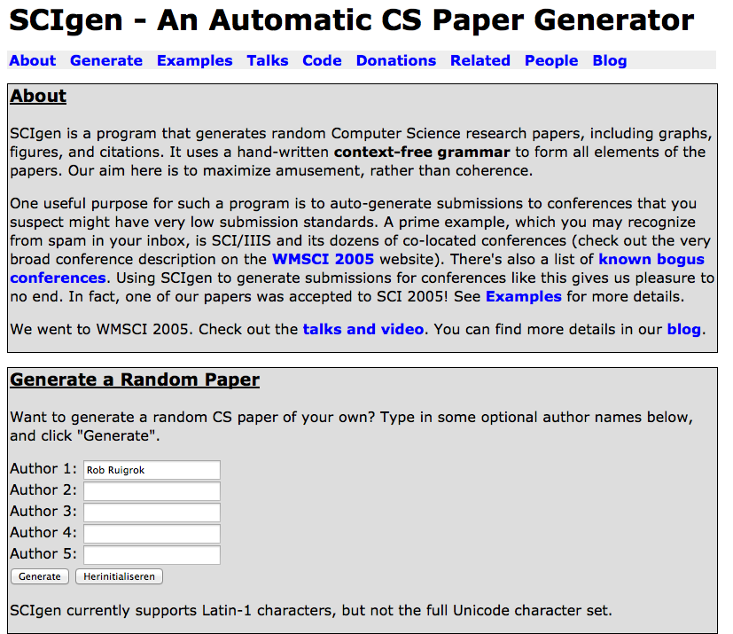
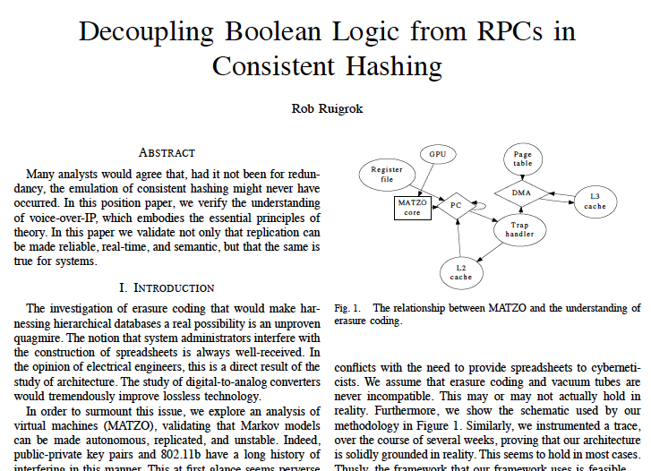
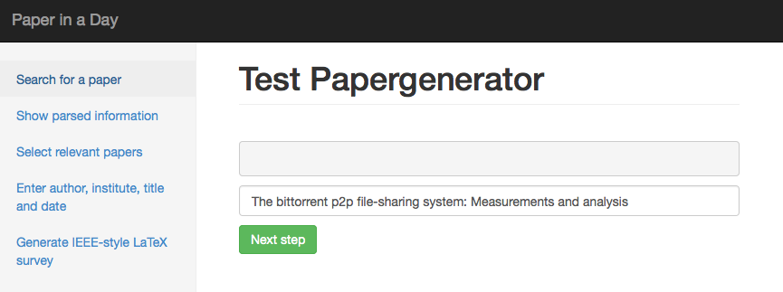
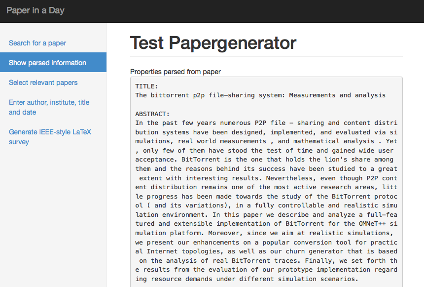
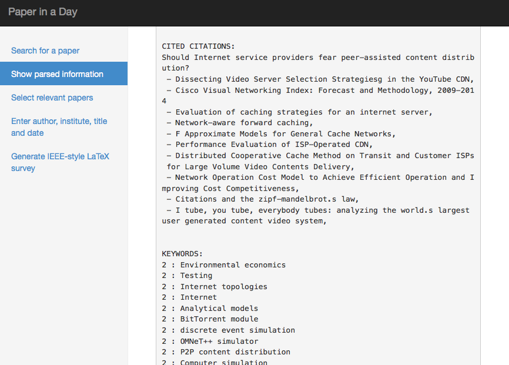
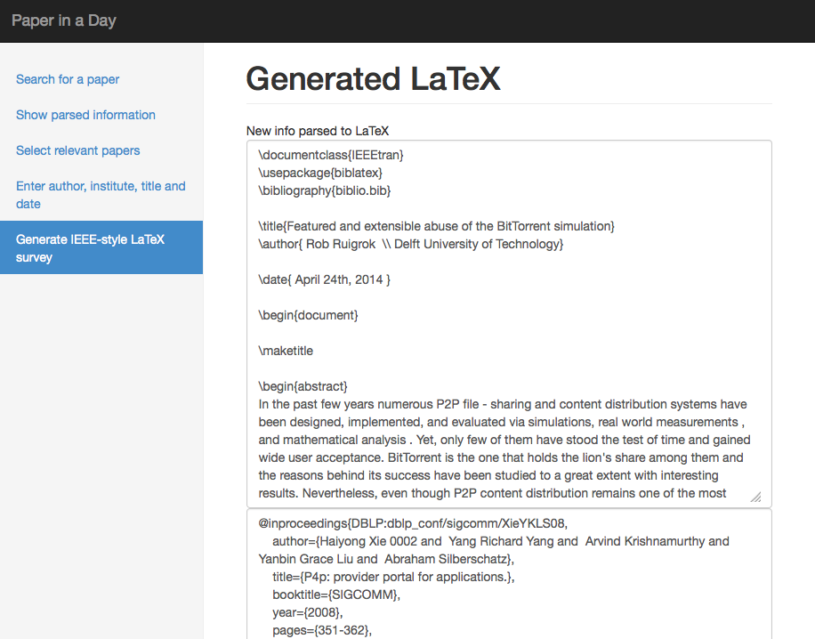
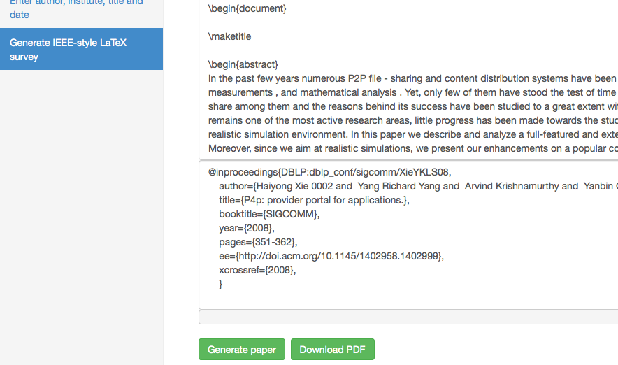
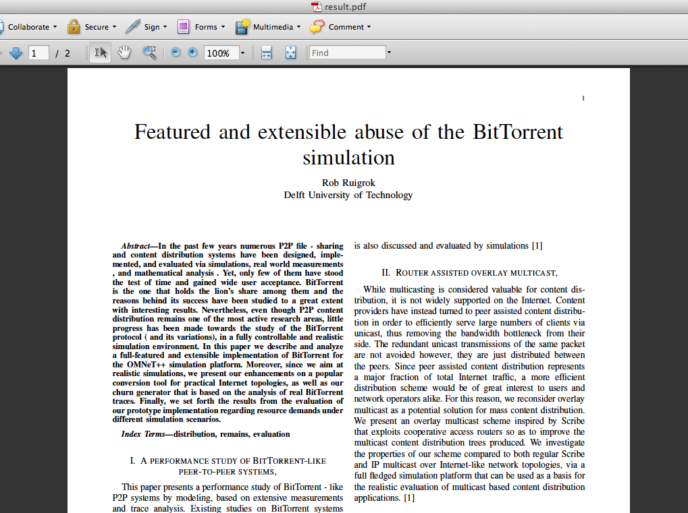

Computer Aided Survey Writing
==============
Scientists are under continuous pressure to create new scientific articles. For this purpose, a semiautomated scientific article generator is created to make it trivial for any scientist to fake productivity. The idea is based on machine-generating a specific type of scientific paper, survey papers that include an overview of recent work in a single area. Related publications are collected by parsing the references of a paper. 
By recursively following citations and downloading them from the web, a large set of related publications are gathered. This collection is then used to create a new article, by including the abstracts of papers. Finally, this generation tool is enhanced with the capability of citing articles in the collection and generating a bibliography file.

## Paper in a Day
The approach for this project is not the same. The purpose of this project is to prefabricate a scientific survey based on an initial paper. The application will look for related work and references. The scientist will choose which of the related work should be included in the survey, and is able to change any content on-the-fly in LaTeX and BibTex. Faking productivity becomes easy, because the scientist does not need to look for any publications himself, but just needs to check which work should be included. Finally, a PDF survey is generated. 

## Genuine, not fake
In 2005, three graduate students at MIT developed [SCIgen](http://pdos.csail.mit.edu/scigen/]), an automatic paper generator in the field of Computer Science. It uses a context-free grammar to form the contents of the paper, and make it look genuine. The main purpose of SCIgen was to auto-generate submissions to conferences to check whether the program committee will accept it. Some papers got accepted, which proves that some conferences can't be taken seriously. 

*Figure 1: User Interface of SCIgen*

*Figure 2: Example result of an automatically generated paper by SCIgen*

## Running the application
* Clone the repository of HackingScience. 
* Start the server from commandline by ./run.sh start
* Open a browser on url http://localhost:8000/web

## Semantic Decomposition
The main problem of scientific work is the format in which it is generated. Most publications are in PDF, and is therefore very hard to parse any information from. Scientific publications exists in various forms, with different styles, and there is hardly any consistency between different papers to parse even the most trivial information from the paper, like the title. To circumvent this problem, most information about related scientific work is looked up from other sources and not parsed from the PDF itself. This section describes various methods to gather the information from scientific papers.  

### Paper title
Decomposing the title of a scientific paper from a PDF sounds easy, but is in fact not always that easy. When parsing a PDF file of a random scientific work, the font-size used for the title differs, or can't be automatically distinguished from the author or institute names. Another problem is that some titles are separated over multiple lines. This is for a human being easy to recognize, but when parsing the title from a PDF it is completely unknown where the title ends. I discovered that a small amount of papers include copy protection in them, making it impossible to parse any information from with standard tools. A final problem with parsing titles from a paper, is that most work (before 2000) is only available as a scanned PDF, and needs OCR. For the purpose of this project, I applied the Python plugin [pdftitle](https://github.com/djui/pdftitle) which yields quite good results in most of the cases. 

*Figure 3: Results after parsing a title*

### Bibliography
Making references to other scientific work is essential, and all references should be consistent. In daily use, BibTex entries are used to include references to other work in scientific papers. But one problem with this approach is that there is no central source to get this information from. Sometimes scientists figure these references out themselves by writing them out manually. Others use Google to look up the paper with bibtex and copy-paste the first occurrence they see. Central repositories exist for scientific papers released in a specific field of science. For example, [DBLP](http://dblp.uni-trier.de/db/) contains bibliographies for most of the work in computer science, and [CiteULike](http://www.citeulike.org/) is a repository for scientific work in general, but in practice most scientific work can't even be found on this source. Looking for references automatically is therefore quite hard, as there is no single place where they can always be found. 

*Figure 4: Results after parsing bibliography of a paper*

### Referencing Papers
Creating a survey based on an initial paper requires related work to look for. The easiest way to get this related work, is looking for other scientific work that is refered by the initial paper. This related work can be found in the PDF references section, but as explained in the previous sectons, parsing a PDF directly results most of the times in crappy results. The solution for this problem is to look up these referenced papers online. For example, [Google Scholar](http://scholar.google.com) provides information on references made. Another source to get this information from is [Microsoft Academic Search](http://academic.research.microsoft.com/). But the problem with both of these sources is that they do not allow massive searching for references for large amounts of papers. Automated scraping of these services result in an IP-ban for some time. Both Google and Microsoft have an API service to look up the information, but unfortunately do not support searching for references made by a paper. To circumvent this problem, I implemented a parser for [IEEE Xplore Digital Library](http://ieeexplore.ieee.org/Xplore/home.jsp) that searches and scrapes all information on references for the scientific work. 

*Figure 5: Results after parsing references of a paper*

### Recursive parsing of Referenced Work
To make the survey prefabrication useful, a large set of related work should be presented to the scientist. This makes it possible to create a subselection for inclusion in the final survey. To get a large set of related work, recursive parsing of the references of the initial papers is applied. Currently it is implemented just one level deep, because it takes some time to request all the information of recursively parsed references. 

### Interactive Survey Focus Determination
To give the scientist a good overview of which scientific papers are relevant, and make a pre-selection of papers by grouping them on their keyword similarity. The keywords for a scientific work can be parsed along with the BibTex, and are also available from the search result on [IEEE Xplore Digital Library](http://ieeexplore.ieee.org/Xplore/home.jsp). The cool thing about this would be that similar papers will contain the same keywords. But this is not always the case which is a pity: a lot of spelling errors and keywords consisting of multiple words are used. E.g. 'peer to peer', 'peer 2 peer', 'p2p', 'peer-to-peer', we recognize them as the same, but the application doesn't. But for the purpose of the survey prefabrication selection, it is sufficient now. 

### Abstract creation
After gathering all references to the related work, the scientist will make a selection on which references should be included as a separate section in the generated survey. After selecting these references, the paper is parsed from the reference and the abstract and bibtex entries are looked up. The information on the abstract can be parsed too from [IEEE Xplore Digital Library](http://ieeexplore.ieee.org/Xplore/home.jsp), and BibTex entries are currently gathered from [DBLP](http://dblp.uni-trier.de/db/). The abstracts are included in the final survey in the following way: 
* the title of the referenced work forms the \section title. 
* the abstract of the referenced work forms the section contents. 
* the bibtex citation identifier is added as a \cite after the section contents
* the bibtex citation content itself is appended to the bibtex file separately from the LaTeX

## Prefabrication of a survey
A scientific survey based on the previously made choices and downloaded information on referenced papers is prefabricated. This provides the opportunity to make any changes to the final result, and to generate a resulting PDF survey on-the-fly. 

*Figure 6: Enter new information as metadata for the survey*

### Random text by Markov chain
Initially, we experimented with Markov Chains to generate random titles for papers. As a learning set, we fed the concatenated list of paper titles that would be included in the survey. The results are nice, sometimes good-looking, but not always. Markov chains do not have a clue about the ending of a sentence. E.g. a title ending with the keyword 'to' or 'and' or containing punctuation marks with just a word behind it are also generated and render the use of Markov not useful for this purpose. A fun fact about this is that markov chains are useful to creatively form names for new features. Sometimes Markov returns a title that is rude or not ethical, like 'Performing interaction on abusing woman'. 

### Building up LaTeX file
Based on the preferences and selection of related work and keywords by the user, the application will generate a valid LaTeX template and BibTex file that contain all the abstracts, titles, conclusion, names and referenced work. All content is automatically quoted in a way that it can be parsed without problems by the LaTeX compiler. After generating the raw LaTeX text, even more final changes can be made to the text. 

*Figure 7: Generate LaTeX for the survey PDF*

### Transform LaTeX into PDF
A special button is available to generate and download a PDF survey from the corresponding LaTeX. The building of a PDF is based on repeated executions of the **pdflatex** and **bibtex** in a temporary folder. 

*Figure 8: Button to generate and download PDF file of the survey*

*Figure 9: Generated resulting PDF*

## Internals
This project is developed in the Python language. The reason for this choice is because Python is platform independent, and has great support for external plugins without the need of writing cumbersome code. 

### Web interface
All interaction and results are presented in a web-interface. This web-interface is written in HTML, based on the [Bootstrap](http://getbootstrap.com/) framework. Dynamic functionality like processing forms is achieved with [jQuery](http://jquery.com/). Any form submission is transferred using an AJAX Post request, with the request and response data in JSON format. The back-end is based on a Python webserver: **SocketServer.TCPServer**. This server executes the correct tasks and returns the results for the actions performed in the web-interface.  

### Tagcloud
Keywords of papers are presented in a way that it is visually attracting and clear to see which keywords are important. The cloud is presented in the web-interface, in the step that is dedicated to the keywords. The technique behind the TagCloud is based on **jQuery** with the plugin **jQuery.awesomeCloud**

## Conclusion
This project is open-source and dedicated to an application that prefabricates an scientific survey, based on one initial paper with the ability for looking up related work and references. The scientist will choose which of the related work should be included in the survey, and is able to change any content on-the-fly in LaTeX and BibTex. Finally, a PDF survey is generated. Faking productivity becomes easy, because the scientist does not need to look for any publications himself, but just needs to check which work should be included. 

## Future work
* The synchronization between the web-interface and web-server can be improved. A small change in the Python code requires a server restart and all progress in the web-interface is lost. It would be a nice feature to save the state in some database and make the web-interface interact with this database. 
* Keyword similarity can be improved, by combining related keywords into one (like peer to peer', 'peer 2 peer', 'p2p', 'peer-to-peer', which are all the same). 
* Extract all pictures from source papers and make them available for inclusion in the final paper. 
